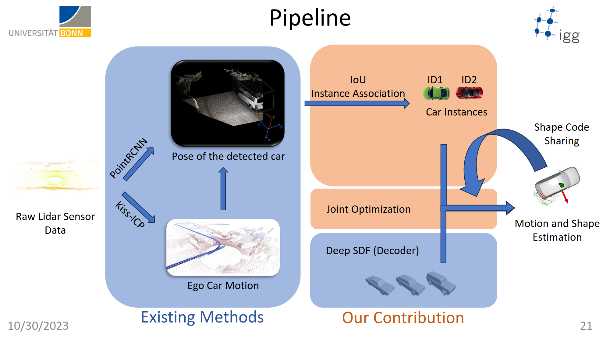
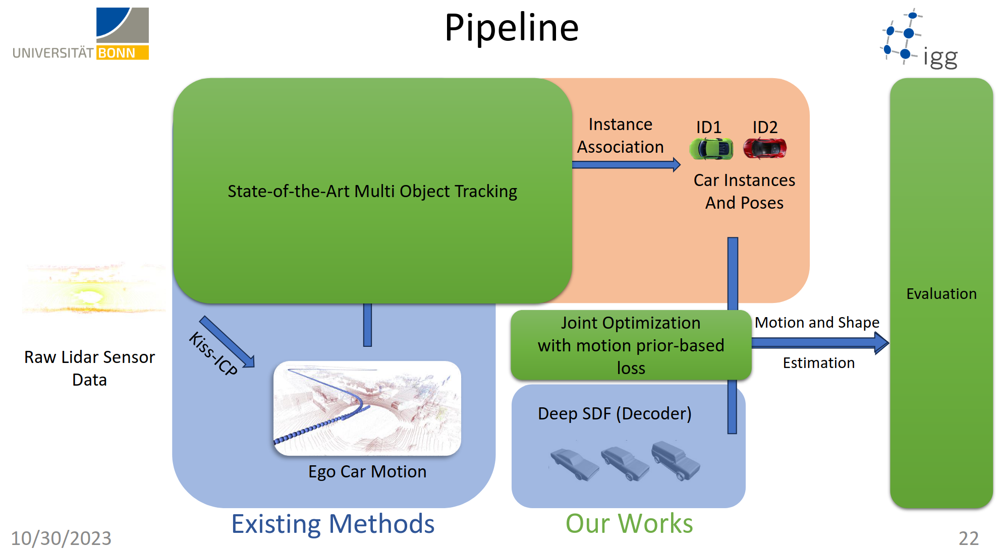
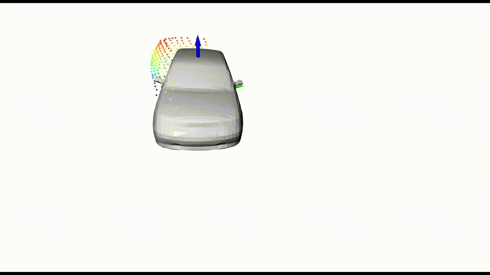

# Instance-Completion-and-Motion-Estimation-with-Deep-Shape-Priors-for-Autonomous-Driving-Presentation

The main contribution of this project is a novel object
tracking and reconstruction approach that combines learned shape priors with Gauss-Newton optimization for robust
dynamic perception in autonomous driving.

[Paper Style Report](./Final_report_MSRP-1.pdf)

[Joint Optimization Notes](./tracking-as-factorgraphs.pdf)

[Tracking as a factorgraph notes](./tracking-as-factorgraphs.pdf)

  
  

<table>
<tr>
    <td></td>
    <td></td>
</tr>
<tr>
    <td></td>
    <td></td>
</tr>
</table>
